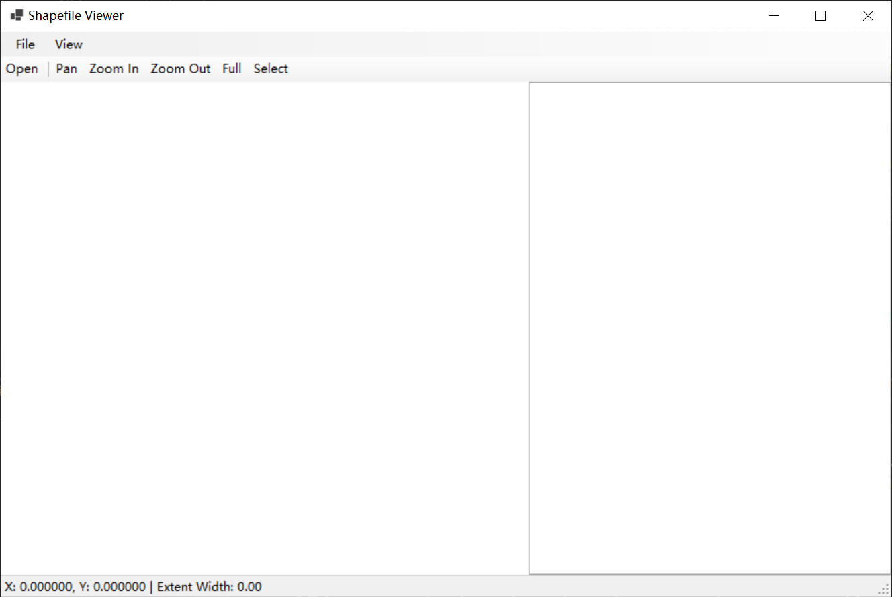
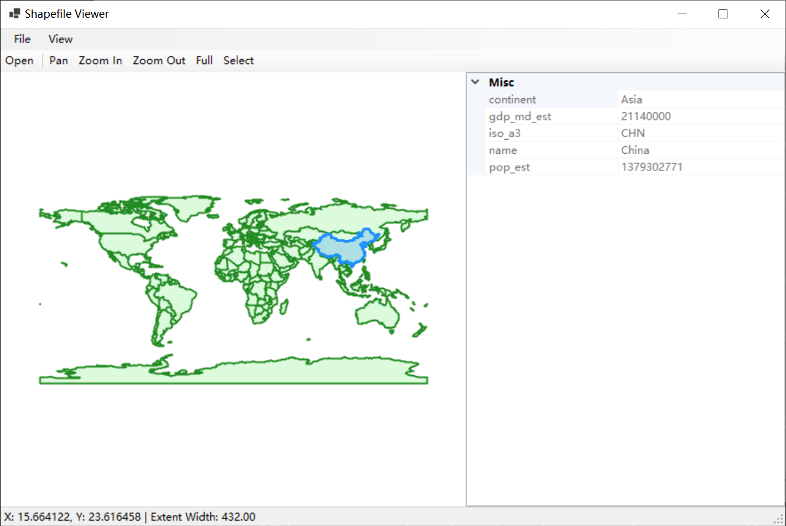

# Shapefile Viewer (DotSpatial · WinForms)

一个使用 DotSpatial 在 WinForms 中加载与浏览 ESRI Shapefile 的示例，支持要素选择与属性查看。

## 功能
- 打开并显示 `.shp` 图层（点/线/面）
- 地图交互：Pan、Zoom In/Out、Full Extent（Ctrl+F）
- 要素选择：点击选中要素并高亮
- 属性查看：右侧 PropertyGrid 展示 `.dbf` 字段和值
- 状态栏显示坐标与当前视图范围宽度
- 缺失文件提示：.shx/.dbf/.prj 缺失时给出警告

## 环境要求
- Visual Studio 2022
- 运行时：.NET Framework 4.8 或 .NET 6（Windows 桌面，UseWindowsForms）
- 平台：x86（32位）
- 依赖包：
  - DotSpatial.Controls
  - DotSpatial.Data
  - DotSpatial.Symbology
  - （可选）DotSpatial.Projections

## 目录
```
Root/
├─ Docs/
│  └─ 任务文档.md
├─ Projects/
│  └─ ShapefileViewer/
│     ├─ ShapefileViewer.csproj
│     ├─ Program.cs
│     └─ MainForm.cs
└─ README.md
```

## 构建与运行
- Visual Studio：
  1) 打开 `Projects/ShapefileViewer/ShapefileViewer.csproj`
  2) 目标平台选择 x86
  3) 还原 NuGet 包并编译运行
- dotnet CLI（如为 SDK 风格 .NET 6 项目）：
  - `dotnet restore`
  - `dotnet build`
  - `dotnet run`（如设置了 RuntimeIdentifier，运行输出目录中的 exe）

## 使用说明
- 打开：File → Open Shapefile（Ctrl+O），选择 `.shp`
- 浏览：View/工具栏切换 Pan、Zoom In、Zoom Out、Full Extent（Ctrl+F）
- 选择：View → Select 或工具栏 Select，地图上点击要素进行选中与高亮
- 属性：右侧 PropertyGrid 自动显示所选要素的 `.dbf` 字段与值
- 清除选择：按 Esc 或点击空白
- 帮助：若仓库根存在 `shapefile.pdf`，通过 Help 菜单打开

## 常见问题
- 没有属性：`.dbf` 缺失或字段为空，程序会提示
- 坐标系未知：`.prj` 缺失时仍可显示，但坐标参考不确定
- 性能：大数据请确保 `.shx` 存在以提升索引与选择性能

## 许可
已采用 MIT License，详见根目录 LICENSE 文件。

## 截图
- 主界面

- 属性查看

